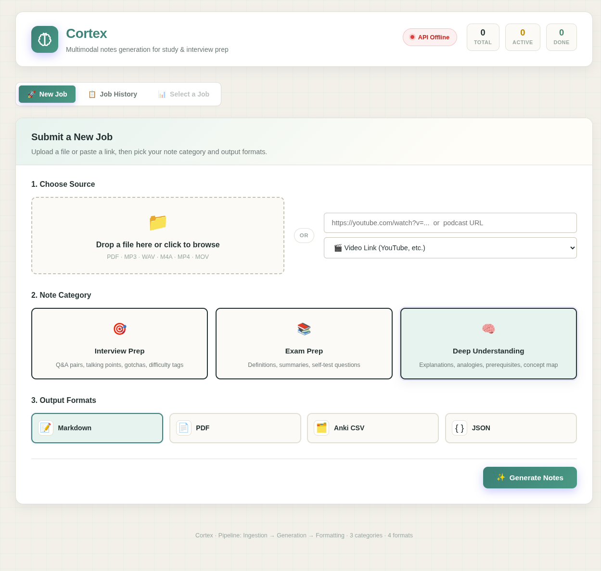
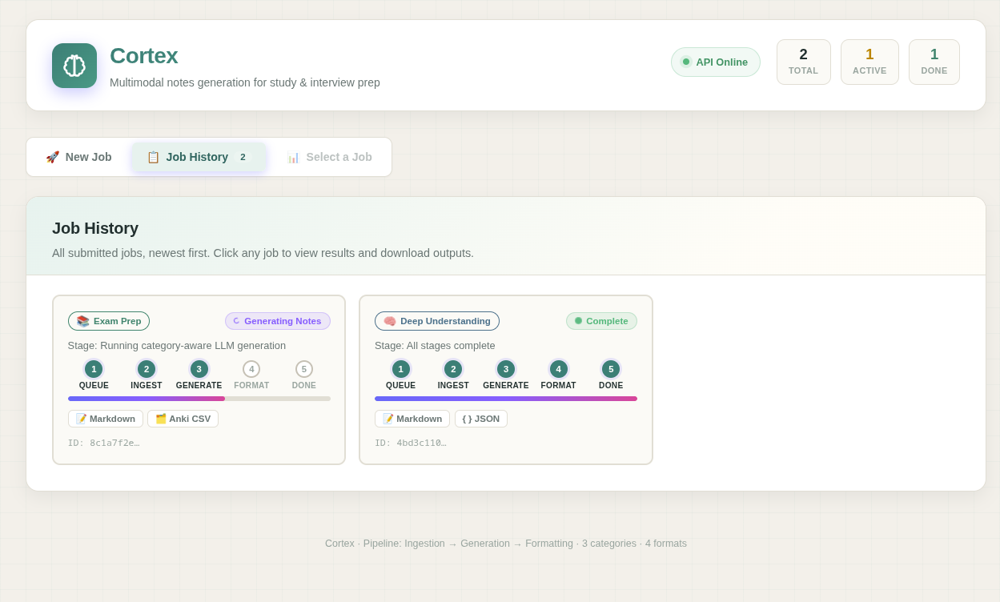
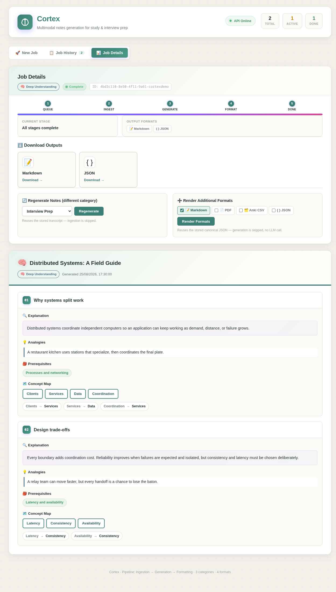

# Cortex: Multimodal, Category-Aware Notes Generation

> Turn **any** learning material — PDFs, audio, video, YouTube links, podcast URLs — into structured, purpose-fit study notes with **one pipeline, zero re-processing**.

Cortex decouples three independent axes — **source ingestion**, **note category**, and **output format** — around a single validated contract: the **Canonical Notes JSON**. This means you can:

- Upload a lecture video once, then toggle between **Interview Prep ↔ Exam Prep ↔ Deep Understanding** notes without re-transcribing.
- Generate Markdown, then later decide you want a PDF or Anki deck too — no LLM call, no re-generation.
- Add a new category or formatter in a single file, never touching the ingestion or orchestration layer.

---

## Features at a Glance

| Capability | Details |
|---|---|
| **📥 Inputs** | PDF · MP3/WAV/M4A · MP4/MOV · YouTube + generic video links · Podcast/audio links |
| **🎯 Note Categories** | `interview` (Q&A, talking points, gotchas) · `exam` (definitions, summaries, self-test) · `understanding` (explanations, analogies, prereqs, concept map) |
| **📤 Output Formats** | Markdown · PDF (WeasyPrint) · Anki-importable CSV · Canonical JSON |
| **🤖 LLM Providers** | **Ollama** (local, zero API-key default: `llama3.1:8b`) · **Google Gemini** (key-based, swap via `.env`) |
| **🗂️ Pipeline Architecture** | Ingestion → Generation → Formatting — each stage independently skippable |
| **🔁 Regenerate-on-demand** | Re-run generation only (`/regenerate`) or formatting only (`/format`) against persisted artifacts |
| **📺 Web Dashboard** | React/Vite UI with tabbed flow: New Job → History → Job Details + inline Notes viewer |
| **🧵 Background Jobs** | Celery + Redis queue; real-time 2.5s polling status with visual 5-stage progress bar |
| **💾 Persistence** | SQLite + local file storage (content-addressed; re-uploads hit the transcript cache) |
| **🧹 Retention** | Configurable auto-cleanup (default 30 days) for uploads and artifacts |
| **🔌 API** | Fully-documented FastAPI REST layer (`GET /docs` for Swagger) |
| **🐳 Deployment** | Single `docker-compose up --build`; host-networking mode included for non-bridge Linux hosts |

---

## UI Tour

The dashboard is a working React/Vite client for the FastAPI service. It keeps the three pipeline stages visible so the user can tell whether a job is extracting, generating, or rendering. The screenshots below are captured from the local application.

### 1. Dashboard — Submit a New Job



Submit any source via drag-and-drop file upload **or** a pasted link. Pick one note category and any combination of output formats — everything else is handled in the background.

### 2. Job History — Track Progress Live



Every job is polled every 2.5s. Each card shows the live stage, progress bar across 5 pipeline steps, selected category, and requested formats. Jobs with errors show a red banner with the human-readable reason.

### 3. Job Details — Notes Viewer & Downloads



Click any completed job to see the inline Notes viewer, one-click downloads for every format, plus the **regenerate** and **additional-format** actions that skip re-ingestion and re-generation respectively.

---

## 🚀 Run Locally — Three Ways

### Prerequisites (All Methods)

| Tool | Required | Notes |
|---|---|---|
| Python ≥ 3.11 | ✅ | (For method 2) |
| Node.js ≥ 18 | ✅ | (For method 2/3) |
| Docker + Compose plugin | ✅ | (For method 1) |
| Ollama + `llama3.1:8b` pulled | ⭐ Optional | Default LLM; **no API key required**. `ollama pull llama3.1:8b` |
| Google Gemini API key | ⭐ Optional | Set `LLM_PROVIDER=gemini` in `.env` to use hosted API |
| Redis server | ✅/⭐ | Required by Celery; included in Compose method |

---

### Method 1: Docker Compose (Recommended)

The Compose file uses Linux host networking mode because some kernel configurations reject Docker veth bridge creation. Services bind directly to `localhost:8000` (API), `5173` (frontend), and `6379` (Redis). Remove `network_mode: host` on bridge-capable hosts.

```bash
# 1. Clone & configure
git clone git@github.com:chiragdhunna/cortex.git
cd cortex
cp .env.example .env
# Edit .env — defaults are Ollama + SQLite, no keys needed.
# For Gemini: LLM_PROVIDER=gemini and set GEMINI_API_KEY.

# 2. (If using Ollama) Make sure the daemon is reachable on the host
ollama pull llama3.1:8b   # only needed once

# 3. Build & start
docker-compose up --build

# 4. Open the UI
xdg-open http://localhost:5173
```

**To verify the stack:**
```bash
# API liveness
curl http://localhost:8000/health
# → {"status":"ok"}

# OpenAPI docs (Swagger UI)
xdg-open http://localhost:8000/docs
```

---

### Method 2: Native / Development Run

```bash
# Backend (terminal tab 1)
cd cortex
cp .env.example .env
# ensure REDIS_URL=redis://localhost:6379/0 and a local Redis is running
pip install -e ".[dev]"
uvicorn api.main:app --reload --port 8000

# Celery worker (terminal tab 2)
celery -A jobs.celery_app worker --loglevel=info --concurrency=1

# Frontend (terminal tab 3)
cd frontend
npm install
npm run dev
# → http://localhost:5173
```

Run the test suite at any time:
```bash
pytest -q
```

---

### Method 3: Frontend-Only Development

When you only want to hack on the UI against an already-running backend:
```bash
cd frontend
npm install
VITE_API_URL=http://my-backend:8000 npm run dev
```

---

## 🧱 Architecture Deep Dive

> The single most important decision in Cortex is the **canonical intermediate representation** separating generation from formatting. Everything else supports that.

```
                      ┌────────────────────┐
                      │   Browser / Client  │
                      │  (React + Vite UI)  │
                      └─────────┬───────────┘
                                │
                      ┌─────────▼───────────┐
                      │   FastAPI Backend    │
                      │  REST + static serve  │
                      └────┬───────────┬────┘
                           │           │
                enqueue job │           │ read/write (SQLAlchemy)
                           ▼           ▼
                  ┌─────────────┐  ┌───────────────┐
                  │   Redis      │  │   SQLite DB    │
                  │   (Celery    │  │ + local file   │
                  │    broker)   │  │   storage      │
                  └──────┬───────┘  └───────┬───────┘
                         │                  │
        ┌────────────────┼──────────────────┴──────────┐
        ▼                ▼                             ▼
 ┌─────────────┐  ┌──────────────┐             ┌───────────────┐
 │  Ingestion   │  │  Generation   │             │  Formatting    │
 │  Worker      │  │  Worker        │             │  Worker        │
 │  PDF extract │  │  category     │             │  canonical JSON│
 │  Whisper     │  │  prompt → LLM │             │  → md / pdf /  │
 │  yt-dlp      │  │  → JSON (Pyd │             │  anki / json   │
 │              │  │    validated) │             │                │
 └──────┬───────┘  └───────┬───────┘             └───────────────┘
        │                  │
        ▼                  ▼
   ┌──────────┐    ┌────────────────┐
   │Transcript│    │  NotesResult   │
   │ (cached, │    │ (canonical     │
   │ content  │    │  Notes JSON)   │
   │  hashed) │    └────────────────┘
   └──────────┘
```

### 3-Stage Pipeline Contract

Each stage is idempotent and independently re-runnable, because every intermediate artifact is persisted with a foreign key on the `Job`:

| Stage | Input → Output | Skip via Endpoint |
|---|---|---|
| **1. Ingestion** | `file/link → Transcript(raw_text, segments, source_meta)` | ⏭️ Implicitly — `run_generation` worker skips to stage 2 |
| **2. Generation** | `Transcript + category prompt + LLM → NotesResult(canonical_json)` | `POST /jobs/{id}/regenerate` (re-runs 2+3 only) |
| **3. Formatting** | `NotesResult(canonical_json) → Artifact(markdown/pdf/anki/json)` | `POST /jobs/{id}/format` (runs 3 only, **zero LLM**) |

### The Canonical Notes JSON (Hard Boundary)

Every category produces the same envelope, with a different `content` shape — formatters never need to know about category, and generators never need to know about output formats.

```json
{
  "category": "interview | exam | understanding",
  "source_title": "string",
  "generated_at": "2025-08-25T12:00:00Z",
  "topics": [
    {
      "title": "string",
      "content": {
        "interview":     { "qa_pairs": [{"q","a","difficulty"}], "talking_points": [], "gotchas": [] },
        "exam":          { "definitions": [{"term","definition"}], "summary": "", "self_test": [{"q","a"}] },
        "understanding": { "explanation": "", "analogies": [], "prerequisites": [], "concept_map": {"nodes":[],"edges":[["a","b"]]} }
      }
    }
  ]
}
```

This boundary means: **Adding a 4th category requires 1 new prompt template + 1 new Pydantic schema** (no touch to formatters, API, or job orchestration). **Adding a 5th format requires 1 pure `bytes ← CanonicalNotes` function** (no touch to LLM or ingestion). See [Extending Cortex](#-extending-cortex) below.

### LLM Reliability

Local open-weight models (Ollama) emit malformed JSON far more often than hosted APIs like Gemini. To handle this uniformly the pipeline is **provider-agnostic in its retry logic**:

1. Every prompt inlines the full JSON Schema, not just "reply in JSON."
2. `core/notes_generator.py:_validated` immediately validates via Pydantic.
3. On failure → retry **at most 2 times** with a corrective prompt including Pydantic's `ValidationError` details.
4. After 3 total failures → job enters `failed` with the specific error `generation_schema_invalid`.

This is tested specifically against a fake Ollama-shaped provider in `tests/test_generation.py` (independent of any live server).

---

## 🔌 REST API Reference

FastAPI serves auto-generated interactive docs at `/docs` (Swagger) and `/redoc`.

### Summary of Endpoints

| Method | Path | Purpose |
|---|---|---|
| `GET` | `/health` | Liveness probe — returns `{"status":"ok"}` |
| `POST` | `/jobs` | Submit a **link** job: `{url, source_type, category, formats[], provider?}` → `{job_id}` |
| `POST` | `/jobs/upload` | Submit a **file upload** job (multipart form: `file`, `category`, `formats[]`, optional `provider`) → `{job_id}` |
| `GET` | `/jobs` | List all jobs, newest first — used by history panel polling |
| `GET` | `/jobs/{job_id}` | Status for one job: `{id, status, stage, error, category, formats}` |
| `GET` | `/jobs/{job_id}/result` | Canonical Notes JSON after generation completes |
| `GET` | `/jobs/{job_id}/download?format=<name>` | Stream a rendered artifact; one of `markdown\|pdf\|anki_csv\|json` |
| `POST` | `/jobs/{job_id}/regenerate` | `{category, provider?}` — re-run **generation only** against the already-stored transcript |
| `POST` | `/jobs/{job_id}/format` | `{formats[]}` — render **formatting only** against the already-stored canonical JSON |

### Job Lifecycle

| Status (`status`) | Transient `stage` | Meaning |
|---|---|---|
| `queued` | `queued` → `ingestion` → `generation` → `formatting` | Job is in the queue; `stage` refines which sub-step is running |
| `transcribing` | `ingestion` | Ingestion worker is active |
| `generating_notes` | `generation` | LLM is being called per chunk + final synthesis |
| `formatting` | `formatting` | Renderers are producing artifacts |
| `done` | `done` | All formats rendered and artifacts persisted |
| `failed` | `<stage that failed>` | Error is stored on `job.error` for the user |

---

## 🧩 Project Layout

```
cortex/
├── api/                      ← FastAPI REST entrypoint
│   └── main.py               ← endpoints, request models, job creation helpers
│
├── core/                     ← Pure business logic (no Celery, no HTTP)
│   ├── config.py             ← pydantic-settings loader
│   ├── models.py             ← SQLAlchemy: Job / Transcript / NotesResult / Artifact
│   ├── database.py           ← Engine, SessionLocal, init_database
│   ├── chunker.py            ← Semantic chunking (~2k tokens, overlap)
│   ├── validation.py         ← Media-duration validator + Pydantic helpers
│   ├── category_prompts.py   ← Prompt builder (inlines JSON Schema)
│   ├── notes_generator.py    ← Chunked map → validated Pydantic → synthesis pass
│   ├── categories/
│   │   ├── schemas.py        ← Three Pydantic models (interview|exam|understanding)
│   │   └── registry.py       ← CATEGORY_MODELS map + get_category_model()
│   └── llm/
│       ├── provider.py       ← LLMProvider Protocol
│       ├── ollama.py         ← REST → localhost:11434
│       ├── gemini.py         ← google-generativeai SDK
│       └── factory.py        ← get_provider(name) reads settings + per-job override
│
├── ingestion/                ← Adapters that produce the common Transcript shape
│   ├── pdf_extractor.py      ← PyMuPDF (fitz)
│   ├── transcriber.py        ← faster-whisper wrapper
│   ├── link_resolver.py      ← yt-dlp (YouTube captions first, else audio-only DL + Whisper)
│   └── schemas.py            ← IngestResult + TranscriptSegment
│
├── formatters/               ← Pure renderers: CanonicalNotes → bytes (NO LLM)
│   ├── markdown.py / pdf.py / anki.py / json_export.py
│   └── registry.py           ← registered_formats() + render_format()
│
├── jobs/                     ← Celery orchestration
│   ├── celery_app.py         ← Celery(redis) instance + autodiscover
│   ├── tasks.py              ← run_pipeline, run_generation, run_format
│   └── cleanup.py            ← Retention sweeper
│
├── frontend/                 ← React 18 + Vite + TypeScript UI
│   ├── index.html, Dockerfile, tsconfig.json, package.json
│   └── src/
│       ├── main.tsx          ← Entire SPA (tabs: New Job · History · Details + NotesViewer)
│       └── style.css         ← Full design system (gradients, chips, progress, cards)
│
├── tests/                    ← pytest suite (unit + stage contracts + skip-stage integration)
│   ├── test_ingestion.py · test_chunker.py · test_generation.py
│   ├── test_validation.py · test_formatters.py · test_orchestration.py
│
├── scripts/
│   └── test_ingest.py        ← CLI smoke test: `python scripts/test_ingest.py pdf <file>`
│
├── pyproject.toml            ← Python project, pytest + ruff config
├── Dockerfile                ← API/worker combined image (runs any command via CMD)
├── docker-compose.yml        ← 4 services: redis · api · worker · frontend
├── .env.example              ← All configuration knobs
├── ARCHITECTURE.md           ← In-depth design doc
├── REQUIREMENTS.md           ← FRs · NFRs · personas · success criteria
├── DECISIONS.md              ← Environment + constraints recorded during build
└── PROGRESS.md               ← Stage-by-stage Definition of Done tracking
```

---

## 📘 Three Note Categories — Explained

Each category produces a **structurally different** output. That difference is enforced by Pydantic schemas at `core/categories/schemas.py`, not just by prose in the prompt.

### 🎯 Interview (`interview`)

Ideal for: conference talks, system design videos, podcast episodes with a senior engineer.

- **`qa_pairs[]`** Question, concise answer, difficulty tag (`easy` / `medium` / `hard`).
- **`talking_points[]`** Bullet talking points to memorize for a live conversation.
- **`gotchas[]`** Edge cases, trick follow-ups, common mistakes an interviewer might probe for.

### 📚 Exam (`exam`)

Ideal for: lecture PDFs, recorded university classes, textbook chapters.

- **`summary`** Paragraph-length summary of the topic.
- **`definitions[]`** Term / definition pairs — perfect for flashcards.
- **`self_test[]`** Likely exam questions with their model answers.

### 🧠 Deep Understanding (`understanding`)

Ideal for: foundational papers, dense whitepapers, conceptual tutorial series.

- **`explanation`** Plain-language explanation of the mechanism.
- **`analogies[]`** Real-world analogies to build intuition.
- **`prerequisites[]`** Bullet list of things you should already know.
- **`concept_map.nodes[]` + `edges[][]`** A lightweight graph the frontend renders as tag pills + labeled arrows (easily upgradable to D3 / React Flow later).

---

## 📤 Four Output Formats

| Format | Extension | Content Type | Notes |
|---|---|---|---|
| **Markdown** | `.md` | `text/markdown` | Headings per topic. Q&A → bold. Definitions → tables/bullets. Most human-readable in repo/Notion/Obsidian. |
| **PDF** | `.pdf` | `application/pdf` | Rendered via **WeasyPrint** from Markdown→HTML pipeline. Styled, print-ready, page numbers. |
| **Anki CSV** | `.csv` | `text/csv` | **Anki Desktop importable** directly: `front,back,tags` columns. Tags include category + topic slug. |
| **JSON** | `.json` | `application/json` | Verbose canonical envelope — for integrations, downstream scripts, or debugging. |

All four formats are rendered from the **same** Canonical Notes JSON with no LLM call. Requesting all four at generation time costs the same LLM tokens as requesting just one.

---

## 🔧 Configuration Reference

All settings live in `.env` (copy `.env.example`). Every setting has a safe local-first default.

| Env Key | Default | Description |
|---|---|---|
| `LLM_PROVIDER` | `ollama` | `ollama` or `gemini`. |
| `OLLAMA_BASE_URL` | `http://localhost:11434` | Where your Ollama daemon lives (use `http://host.docker.internal:11434` inside Docker on non-host-network). |
| `OLLAMA_MODEL` | `llama3.1:8b` | Any model you've `ollama pull`-ed. |
| `GEMINI_API_KEY` | *(empty)* | Required only if `LLM_PROVIDER=gemini`. |
| `DATABASE_URL` | `sqlite:///./cortex.db` | SQLAlchemy URL. Swap for `postgresql+psycopg://…` for Postgres. |
| `REDIS_URL` | `redis://localhost:6379/0` | Celery broker/result backend. |
| `WHISPER_MODEL` | `base` | `tiny` · `base` · `small` · `medium` · `large-v3`. Larger = more accurate, slower. |
| `MAX_UPLOAD_MB` | `500` | Rejected by the API before accepting a job. |
| `MAX_DURATION_SECONDS` | `10800` (3h) | Rejected for audio/video uploads before transcription starts. |
| `RETENTION_DAYS` | `30` | Jobs, transcripts, artifacts, uploads older than this are deleted by the cleanup sweeper. |
| `STORAGE_DIR` | `./storage` | Where uploads + artifacts live on disk. |

---

## 🧪 Testing

```bash
# Full suite
pytest -q

# Coverage report
pytest --cov=core --cov=ingestion --cov=formatters --cov=jobs --cov=api

# Specific areas
pytest tests/test_orchestration.py -v      # Skip-stage integration tests
pytest tests/test_generation.py -v         # Provider-agnostic JSON retries
pytest tests/test_formatters.py -v         # 4 formatters against a canonical fixture
```

Coverage by test file:

| File | What it verifies |
|---|---|
| `test_ingestion.py` | PDF extractor / Whisper adapter contracts (mocked), link resolver input types |
| `test_chunker.py` | Long-text chunk boundaries, preservation, overlap correctness |
| `test_validation.py` | Media duration bounds + Pydantic schema boundary cases |
| `test_generation.py` | Provider interface, schema-invalid JSON retry path (Ollama-shaped fake), category registry |
| `test_formatters.py` | All four renderers against a shared canonical fixture (no LLM) |
| `test_orchestration.py` | Full pipeline with faked workers; `/regenerate` skips ingestion; `/format` skips generation |

Manual smoke tests (after `pip install -e .`):
```bash
# Ingestion adapters directly
python scripts/test_ingest.py pdf path/to/slides.pdf
python scripts/test_ingest.py audio sample.wav
python scripts/test_ingest.py link https://youtu.be/dQw4w9WgXcQ video

# Live end-to-end via the API + worker (need Redis running locally)
```

---

## 🛠️ Extending Cortex

### Add a 4th Note Category (e.g. "Quick Skim")

**One file, no other changes.** Register a new schema + prompt and you're done:

1. In `core/categories/schemas.py` — add a Pydantic model (e.g. `QuickSkimNotes` → `{bullets:[], tl_dr:string, takeaways:[]}`).
2. Add it to the `CATEGORY_MODELS` dict in the same file.
3. The prompt builder in `core/category_prompts.py` auto-inlines the new schema. No prompt file to edit.
4. Formatters keep working unchanged — any category renders via the same envelope of `topics[]`.

### Add a 5th Output Formatter (e.g. "Notion MD", "Obsidian Canvas", "DOCX")

**One file, no other changes.**

1. Create `formatters/notion_md.py` with a function:
   ```python
   from core.categories.schemas import CanonicalNotes
   def render(notes: CanonicalNotes) -> tuple[bytes, str, str]:
       ...
       return bytes_, "text/markdown", "notion.md"
   ```
2. Decorate / import-register it via `formatters/registry.py` (`register_format("notion_md", render)`).
3. Import the module inside `formatters/__init__.py` so registration runs on app startup.
4. Frontend auto-surfaces it. API accepts it. No LLM touched.

### Add a 3rd LLM Provider (Anthropic, OpenAI, Mistral)

**One file, no other changes.**

1. Create `core/llm/openai.py` implementing `LLMProvider` from `core/llm/provider.py`.
2. Add a case in `core/llm/factory.py:get_provider()` for the name `"openai"`.
3. Pass `provider="openai"` on any individual job, or set `LLM_PROVIDER=openai` globally.

---

## 🐳 Deployment Notes & Non-Bridge Hosts

The default `docker-compose.yml` uses `network_mode: host` and `build.network: host`. This is a workaround for Linux kernels (notably some EndeavourOS configs) where Docker cannot create veth bridge pairs (`operation not supported`). Consequences:

- **Pros**: Services bind to `localhost` directly; Redis and Ollama on the host are automatically reachable at `localhost:6379` and `localhost:11434`.
- **Cons**: Can't use per-service DNS names or port remapping — so ports 8000, 5173, 6379 must be free on the host.

On a standard bridge-capable Docker host, remove the two `network_mode: host` lines and the `build.network: host` line, then restore the normal `ports:` mappings and use inter-service DNS:

```yaml
services:
  api:
    environment:
      REDIS_URL: redis://redis:6379/0
      # If using host Ollama: use host.docker.internal or host network for one service
    depends_on: [redis]
  frontend:
    ports: ["5173:5173"]
    depends_on: [api]
  redis:
    image: redis:7-alpine
    ports: ["6379:6379"]
```

See [DECISIONS.md](file:///home/chiragdhunna/Desktop/docs/github_projects/cortex/DECISIONS.md) for the full constraint log recorded during the original build.

---

## 🤝 FAQ / Troubleshooting

**Q: Do I need a paid API key to run Cortex?**
No. Default `LLM_PROVIDER=ollama`. Just `ollama pull llama3.1:8b` locally and you're done. Gemini is supported as a swap-in upgrade.

**Q: A job shows "API Offline" in the header?**
The React frontend can't reach the FastAPI backend on `VITE_API_URL` (default `http://localhost:8000`). Check: is `uvicorn` / the Compose `api` service running? Is the port reachable from your browser (not blocked by a CORS proxy or firewall)? In Compose host-network mode, always visit `http://localhost:5173` so the frontend makes same-machine calls to `localhost:8000`.

**Q: Frontend says `CORS policy blocked the fetch`?**
FastAPI's default CORS for dev is permissive; production builds should set a specific allow-list. `docker-compose.yml` exposes both; if running behind a reverse proxy, add `ALLOWED_ORIGINS` middleware.

**Q: My Ollama connection from inside Compose fails.**
`OLLAMA_BASE_URL=http://host.docker.internal:11434` is the `.env.example` default for Docker containers (works on Docker Desktop / Mac / Windows with host-gateway). On Linux with `network_mode: host`, use `http://localhost:11434`.

**Q: Jobs stay on `queued` forever.**
That means no Celery worker is consuming the queue. Make sure `celery -A jobs.celery_app worker` is running (the Compose `worker` service), and `REDIS_URL` is pointing at the same Redis the worker is configured for.

**Q: I re-uploaded the same file — why was it fast?**
Transcripts are stored keyed by SHA-256 of the source. A re-upload hits the cache: ingestion is skipped, and the job goes straight to Generation. Same for re-pasted links (hash of URL).

**Q: I want to reset / start over.**
```bash
rm -f cortex.db
rm -rf storage/
# then re-run docker-compose up or uvicorn — init_database() runs on startup.
```

---

## 📄 License & Development

Cortex is being developed in stages tracked by [PROGRESS.md](file:///home/chiragdhunna/Desktop/docs/github_projects/cortex/PROGRESS.md) — a full Definition of Done checklist plus per-stage log.

Additional engineering artifacts:
- [ARCHITECTURE.md](file:///home/chiragdhunna/Desktop/docs/github_projects/cortex/ARCHITECTURE.md) — full system-context diagram, data-flow walkthrough, technology rationale.
- [REQUIREMENTS.md](file:///home/chiragdhunna/Desktop/docs/github_projects/cortex/REQUIREMENTS.md) — personas, FRs, NFRs, out-of-scope, success criteria.
- [DECISIONS.md](file:///home/chiragdhunna/Desktop/docs/github_projects/cortex/DECISIONS.md) — environment-specific constraints encountered during the build.

---

**Built with: FastAPI · Celery · Redis · SQLAlchemy · PyMuPDF · faster-whisper · yt-dlp · WeasyPrint · Ollama · Google Gemini · React 18 · Vite · TypeScript · Docker Compose.**
